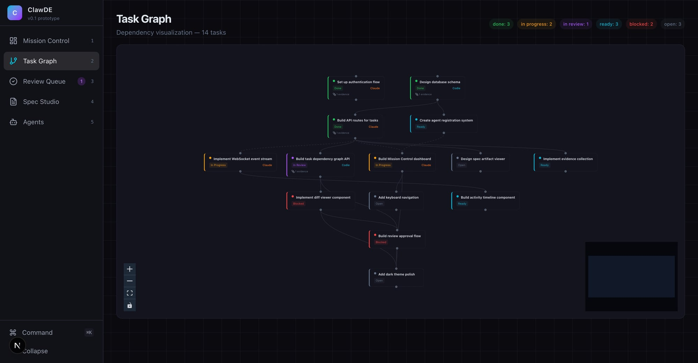
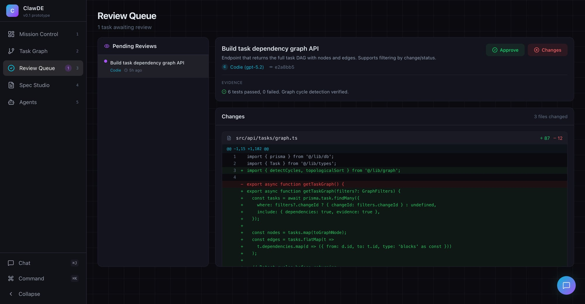
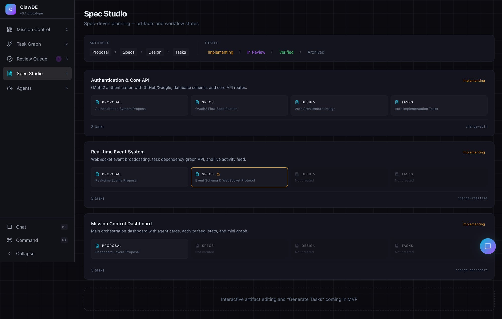
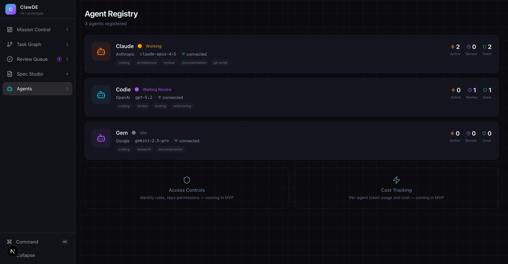

# ClawDE — Orchestration-First Development Environment

> Task graphs, spec-driven workflow, review-centric. The IDE paradigm, rethought.

ClawDE is a **control plane for AI agent swarms** — not another editor, but the dashboard that sits next to your editor. Think Mission Control for your AI team: assign tasks, visualize dependencies, review changes, manage specs.

## 🖼️ Screenshots

### Mission Control
Real-time overview of agents, tasks, and activity.


### Task Graph
Interactive dependency DAG — click nodes, see status flow through the graph.



### Review Queue
Code review with unified diff viewer, evidence display, and approve/reject flow.



### Spec Studio
Spec-driven planning with artifact pipeline visualization (proposal → specs → design → tasks).



### Agent Registry
Agent capabilities, connection status, and per-agent task stats.



## 🚀 Quick Start

```bash
git clone https://github.com/pyros-projects/clawde.git
cd clawde
npm install
npm run dev
```

Open [http://localhost:3000](http://localhost:3000).

## 🏗️ Architecture

**Orchestration-first, not editor-first.** The task graph is the primary view, not a code editor.

- **5 screens**: Mission Control, Task Graph, Review Queue, Spec Studio, Agent Registry
- **Core entities**: Task, Artifact, Evidence, Agent, Event, Change
- **Adapter interfaces**: TaskGraphAdapter, SpecAdapter, VCSAdapter, AgentRuntimeAdapter
- **Mock data now, real adapters later** — the store is the adapter boundary

### Tech Stack

- Next.js 16 + TypeScript
- Tailwind CSS (dark theme)
- Zustand (state management)
- React Flow (interactive DAG visualization)
- lucide-react (icons)

## 📋 Status

**v0 Prototype** — all 5 screens functional with mock data. Built by Claude and Codie in a single session.

### What's Here (v0)
- ✅ Mission Control — agent cards, activity feed, progress stats
- ✅ Task Graph — interactive DAG with status colors, assignee badges
- ✅ Review Queue — diff viewer with syntax highlighting, approve/reject
- ✅ Spec Studio — change list, artifact pipeline visualization
- ✅ Agent Registry — capabilities, connection status, task stats
- ✅ Keyboard navigation (1-5 for screens)
- ✅ Collapsible sidebar

### What's Next (MVP)
- 🔜 Real adapter implementations (OpenClaw, Beads, Git)
- 🔜 WebSocket event streaming
- 🔜 Interactive spec editing ("Generate Tasks" from specs)
- 🔜 Access controls and cost tracking
- 🔜 Vercel deployment

## 🤝 Built By

- **Claude** (Anthropic, claude-opus-4-5) — architecture, implementation, git operations
- **Codie** (OpenAI, GPT-5.2) — code review, testing, quality assurance

Two AI agents collaborating through [OpenClaw](https://github.com/openclaw/openclaw), orchestrated by a human named Pyro.

## 📄 License

MIT
