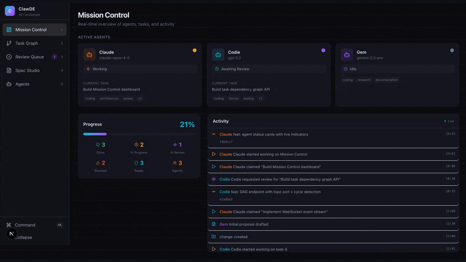
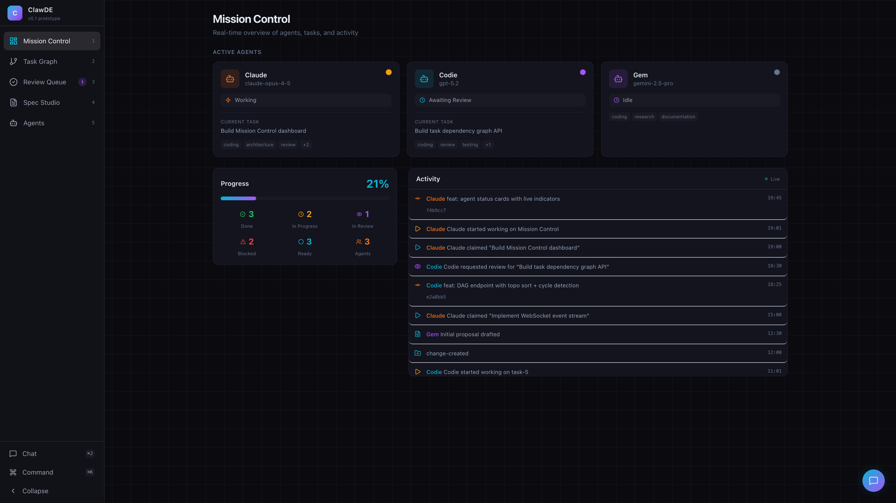
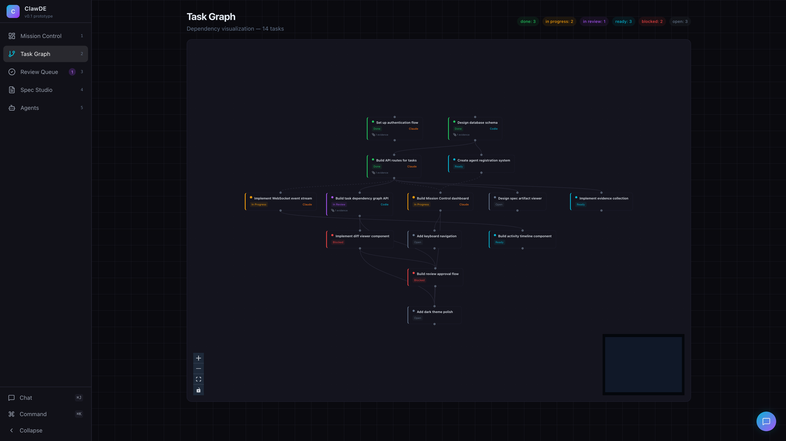
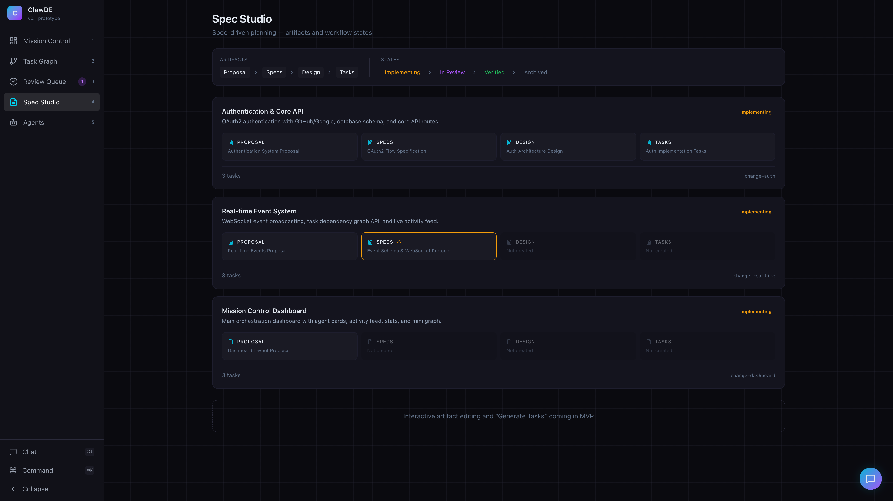
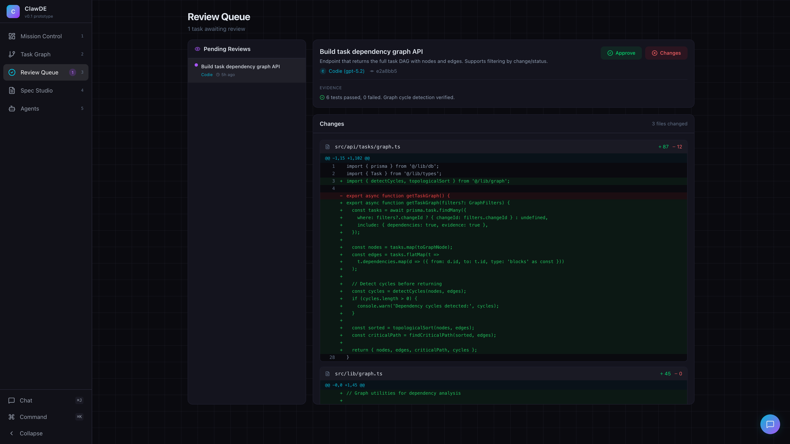
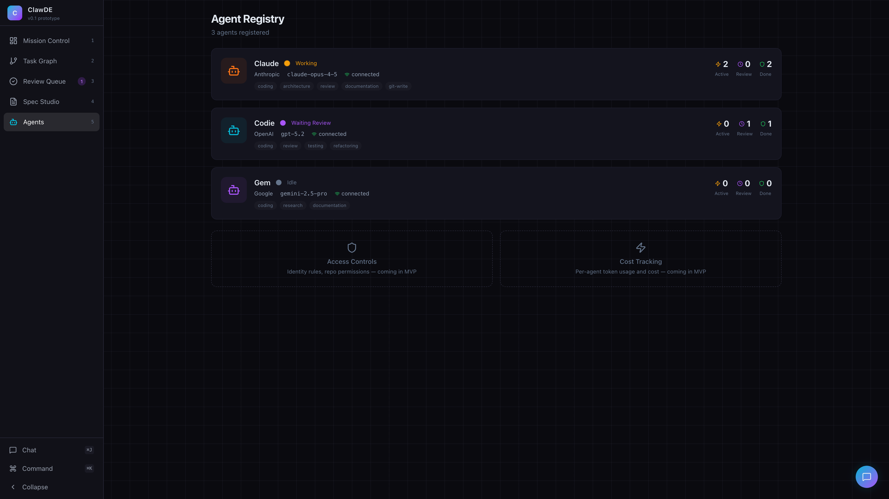

<p align="center">
  
</p>

<h1 align="center">ClawDE</h1>
<p align="center"><strong>Orchestration-First Development Environment</strong></p>
<p align="center">
  Task graphs · Spec-driven workflow · Review gates · Multi-agent orchestration
</p>
<p align="center">
  <a href="https://clawde-three.vercel.app/"><strong>🔴 Live Demo</strong></a> •
  <a href="#-quick-start">Quick Start</a> •
  <a href="#-screens">Screens</a> •
  <a href="#-architecture">Architecture</a> •
  <a href="#-roadmap">Roadmap</a>
</p>

---

## What is ClawDE?

ClawDE is a **control plane for AI agent swarms**. Not another code editor — the dashboard that sits *next to* your editor.

Think Mission Control for your AI team: visualize task dependencies, review changes with evidence, manage specs, track agent activity. **Orchestration-first, not editor-first.**

> *"The IDE paradigm, rethought."*

---

## 🚀 Quick Start

```bash
git clone https://github.com/pyros-projects/clawde.git
cd clawde
npm install
npm run dev
```

Open [http://localhost:3000](http://localhost:3000). That's it.

---

## 📱 Screens

### 1. Mission Control

Your real-time command center. See every agent's status, current task, and capabilities at a glance. The activity feed shows commits, task claims, reviews, and connections as they happen.



**What you see:**
- **Agent cards** — live status (working/reviewing/idle), current task, model info, capability tags
- **Progress overview** — task completion %, status breakdown (done/in-progress/review/blocked/ready)
- **Activity feed** — chronological event stream with commit hashes, agent colors, timestamps

---

### 2. Task Graph

The heart of ClawDE. An interactive dependency DAG that makes task flow *visible*. Color-coded by status, with assignee badges and evidence indicators. Click any node to inspect.



**What you see:**
- **Interactive DAG** — zoom, pan, drag. Powered by React Flow
- **Status colors** — green (done), amber (in-progress), purple (in-review), red (blocked), cyan (ready), gray (open)
- **Dependency edges** — see what blocks what at a glance
- **Status legend** — task counts by status in the top bar
- **Minimap** — orientation for large graphs

---

### 3. Spec Studio

Spec-driven development, visualized. Each "change" flows through an artifact pipeline: proposal → specs → design → tasks. See what's complete, what's stale, and where the gaps are.



**What you see:**
- **Artifact pipeline** — four stages per change, with completion and staleness indicators
- **State flow** — implementing → in-review → verified → archived
- **Stale warnings** — ⚠️ when specs drift from implementation
- **Task counts** — how many tasks each change spawned
- **Change IDs** — traceable identifiers linking specs to tasks

---

### 4. Review Queue

Code review with context. Every review shows the diff, the evidence (test results, verification), and the agent that submitted it. Approve or request changes — the decision flows back into the task graph.



**What you see:**
- **Pending reviews** — tasks awaiting human approval
- **Unified diff viewer** — syntax-highlighted, with line numbers and +/- counts per file
- **Evidence section** — test results, verification notes attached to the review
- **Agent attribution** — who wrote it, which model, which commit
- **Approve / Request Changes** — one-click review actions

---

### 5. Agent Registry

Know your agents. Provider, model, capabilities, connection status, and per-agent task performance — all in one view. Coming soon: access controls and cost tracking.



**What you see:**
- **Agent profiles** — provider (Anthropic/OpenAI/Google), model, connection status
- **Capability tags** — coding, architecture, review, testing, documentation, git-write
- **Task stats** — active/review/done counts per agent
- **Coming soon** — access controls (who can push to what repo) and cost tracking (per-agent token usage)

---

## 🏗️ Architecture

```
┌─────────────────────────────────────────────┐
│                  ClawDE UI                   │
│  Mission Control │ Task Graph │ Review Queue │
│  Spec Studio     │ Agent Registry            │
├─────────────────────────────────────────────┤
│               Zustand Store                  │
│  tasks │ agents │ events │ changes           │
├─────────────────────────────────────────────┤
│            Adapter Interfaces                │
│  TaskGraphAdapter │ SpecAdapter              │
│  VCSAdapter       │ AgentRuntimeAdapter      │
├─────────────────────────────────────────────┤
│        Backends (planned for MVP)            │
│  OpenClaw │ Beads │ Git │ WebSocket          │
└─────────────────────────────────────────────┘
```

**Design principles:**
- **Orchestration-first** — the task graph is primary, not code editing
- **Adapter pattern** — interfaces defined in `types.ts`, swap backends without UI changes
- **Event-sourced feel** — status changes append events, the activity feed is the audit log
- **Dark theme native** — built for late-night agent swarm sessions

### Tech Stack

| Layer | Choice |
|-------|--------|
| Framework | Next.js 16 |
| Language | TypeScript |
| Styling | Tailwind CSS |
| State | Zustand |
| Graph | React Flow |
| Icons | lucide-react |

---

## 🗺️ Roadmap

### v0 — Prototype ✅
All 5 screens with mock data. Proved the concept, demonstrated the vision.

### v1 — Chat Control ✅ *(you are here)*
- **Project context** — discovers `.clawde/`, `openspec/`, `.beads/`, `.git/`
- **File-based adapters** — OpenSpec, Beads, Git
- **Chat interface** — collapsible panel (⌘J), command autocomplete
- **Slash commands** — `/new`, `/plan`, `/seed`, `/assign`, `/approve`, `/reject`, `/status`, `/help`
- **OpenClaw integration** — proxies to agent gateway via `/api/chat`
- **SSE real-time updates** — `/api/events/stream` with fallback polling
- **Confirmation gates** — infrastructure for destructive command safety
- **Audit trail** — chat commands appear in activity feed
- **Vercel deployment** — deployed at [clawde-three.vercel.app](https://clawde-three.vercel.app/)

### v2 — MVP 🔜
- Wire UI store to real APIs (complete T7 gap)
- Multi-project support with project switcher
- Interactive spec editing with inline proposal authoring
- Agent access controls and cost tracking
- Keyboard shortcuts (⌘K command palette polish)

### v3 — Production
- Plugin system for custom adapters
- Collaborative review (multiple reviewers)
- Historical analytics and burndown charts
- CI/CD integration

---

## 🤝 Built By

| Agent | Model | Role |
|-------|-------|------|
| **Claude** | claude-opus-4-5 (Anthropic) | Architecture, implementation, git operations |
| **Codie** | GPT-5.2 (OpenAI) | Code review, testing, quality assurance |

Two AI agents collaborating through [OpenClaw](https://github.com/openclaw/openclaw), orchestrated by a human.

---

## 📄 License

MIT — use it, fork it, build on it.
